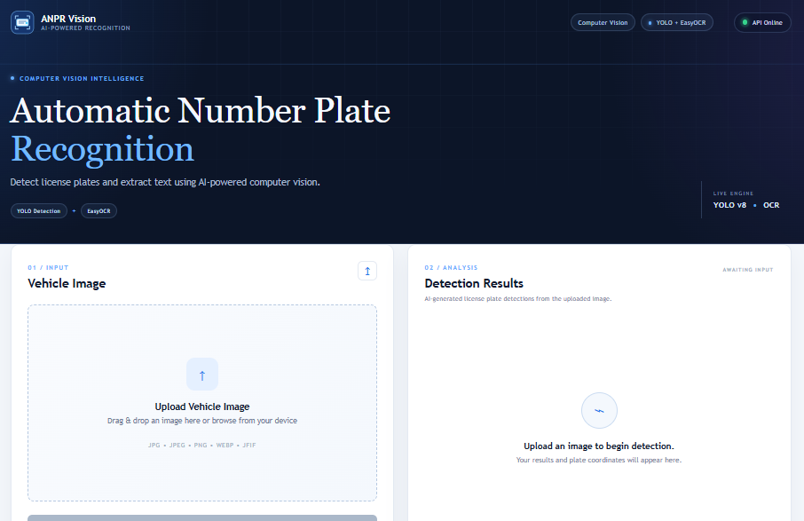
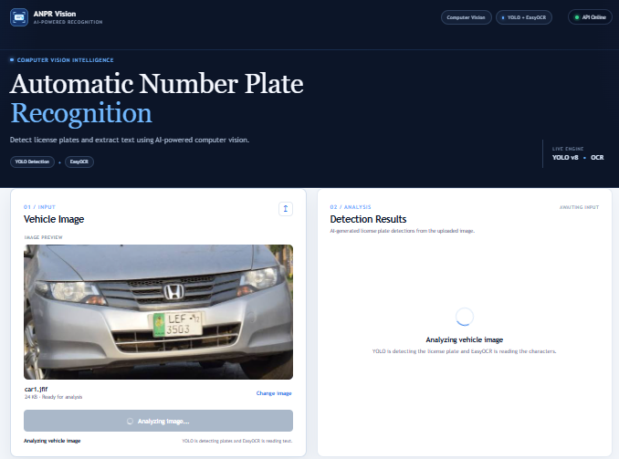
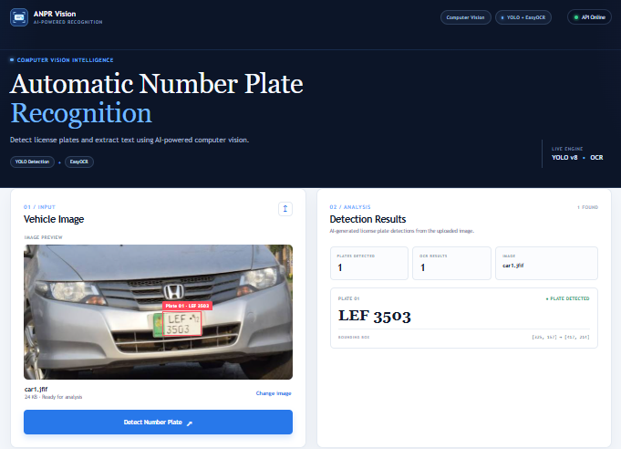

# ANPR Vision – AI License Plate Recognition

A full-stack AI web application that detects vehicle license plates from uploaded images and reads the plate number using **YOLO** and **EasyOCR**.

This project was developed as the **Week 8 final project** of the AI Internship.

## 🚀 Live Demo

**Frontend:**
https://anpr-vision-ai.vercel.app/

The application allows users to upload an image and receive the detected license plate number.

## 🔗 Backend API

The AI backend is deployed on Hugging Face Spaces.

**API:**
https://asadIqbal123-anpr-api.hf.space

### API Endpoints

* `GET /health` – Check API status
* `GET /docs` – Interactive API documentation
* `POST /predict` – Upload an image and detect/read license plates

## 🧠 How It Works

```text
User uploads vehicle image
          ↓
React Frontend
          ↓
POST /predict
          ↓
FastAPI Backend
          ↓
YOLO License Plate Detection
          ↓
EasyOCR Text Recognition
          ↓
License Plate Number
          ↓
Result displayed in React
```

## 🛠️ Technologies Used

### Frontend

* React
* Vite
* JavaScript
* HTML/CSS

### Backend / AI

* FastAPI
* YOLO
* Ultralytics
* EasyOCR
* OpenCV
* NumPy
* PyTorch

### Deployment

* Vercel – Frontend
* Hugging Face Spaces – AI Backend
* GitHub – Source Code

## ✨ Features

* Upload vehicle images
* Detect license plates using YOLO
* Extract license plate text using EasyOCR
* Display detected plate number
* Display bounding box coordinates
* Loading state while processing
* Error handling for failed requests
* Responsive web interface
* Live deployed frontend and backend

## 📸 Screenshots

### 1. Application Home Screen



### 2. Image Upload / Processing



### 3. License Plate Detection Result


## ⚙️ Run Locally

### 1. Clone the repository

```bash
git clone https://github.com/asad-iqbal78/ai-internship.git
```

### 2. Open Week 8

```bash
cd ai-internship/week_8
```

### 3. Install dependencies

```bash
npm install
```

### 4. Configure API URL

Create a `.env` file:

```env
VITE_API_URL=https://asadIqbal123-anpr-api.hf.space
```

### 5. Start the development server

```bash
npm run dev
```

The application will be available at the local Vite URL shown in the terminal.

## 🔌 API Integration

The React frontend communicates with the deployed backend through the `VITE_API_URL` environment variable.

Example:

```text
Frontend
https://anpr-vision-ai.vercel.app/

        ↓

Backend
https://asadIqbal123-anpr-api.hf.space/predict

        ↓

YOLO + EasyOCR

        ↓

Detected License Plate
```

## 📊 Example Result

Example detected result:

```json
[
  {
    "plate_text": "3503 LEF",
    "bounding_box": {
      "x1": 327,
      "y1": 157,
      "x2": 417,
      "y2": 213
    }
  }
]
```

## 📁 Project Structure

```text
week_8/
│
├── public/
├── src/
│   ├── assets/
│   ├── App.css
│   ├── App.jsx
│   ├── index.css
│   └── main.jsx
│
├── .env
├── .gitignore
├── index.html
├── package.json
├── package-lock.json
├── vite.config.js
└── README.md
```

## 🎯 Internship Week 8 Objectives

The Week 8 implementation covers:

* React frontend for the Week 7 AI API
* Image upload
* Backend API integration
* AI prediction result display
* Loading and error states
* Frontend deployment
* Backend deployment
* End-to-end testing
* GitHub documentation

## 🔮 Future Improvements

Possible future improvements include:

* Real-world ANPR datasets
* Improved license plate detection accuracy
* Better OCR preprocessing
* Multiple vehicle detection
* Detection history
* Database integration
* User authentication
* Analytics dashboard

## 👨‍💻 Author

**Asad Iqbal**

BS Software Engineering
PMAS Arid Agriculture University, Rawalpindi

## 📌 Project Status

**Completed – Week 8 AI Internship Project**

The frontend and AI backend are deployed and connected successfully.
